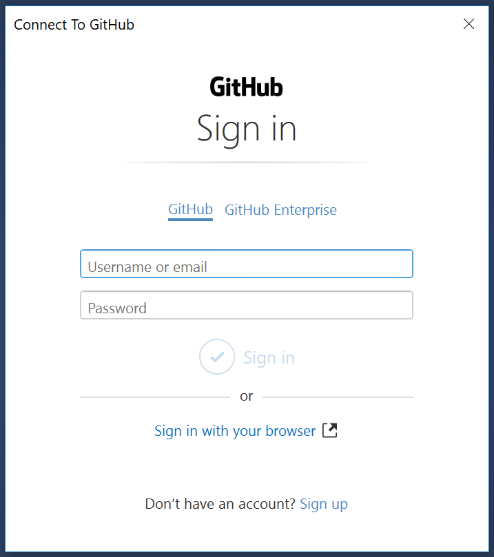
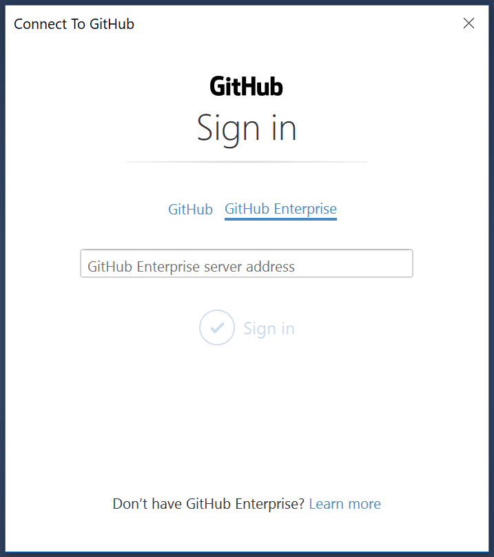

# Authenticating to GitHub

Add your GitHub.com or GitHub Enterprise account information to GitHub Desktop so you can access your repositories.

Before you authenticate, you must already have a GitHub or GitHub Enterprise account.

- For more information on creating a GitHub account, see "[Signing up for a new GitHub account](https://help.github.com/articles/signing-up-for-a-new-github-account/)".
- For a GitHub Enterprise account, contact your GitHub Enterprise site administrator.

> **Note:** If your organization is on the [Business plan](https://help.github.com/articles/organization-billing-plans) and has enabled SAML single sign-on, or an [Enterprise account] you must create and authorize a personal access token to access protected content. For more information on creating personal access tokens, see "[Creating a personal access token for the command line](https://help.github.com/articles/creating-a-personal-access-token-for-the-command-line). The required scopes for the personal access token are: `user`, `repo`, `gist`, and `write:public_key`.

> For more information on authenticating with SAML single sign-on, see "[About authentication with SAML single sign-on](https://help.github.com/articles/about-authentication-with-saml-single-sign-on)."

1. In Visual Studio, select **Team Explorer** from the **View** menu.

2. In the Team Explorer pane, click the **Manage Connections** toolbar button.

3. Click the **Connect** link in the GitHub section. If you are already connected to a GitHub instance and want to connect to another, this link will not be visible; instead click **Manage Connections** and then **Connect to GitHub**.

4. In the **Connect to GitHub dialog** choose **GitHub** or **GitHub Enterprise**, depending on which product you're using.

- **GitHub option**:  
  
  - To sign in with credentials, enter either username or email and password.
  - To sign in with SSO, select `Sign in with your browser`.

- **GitHub Enterprise option**:  
  
  - To sign in with credentials, first enter GitHub Enterprise server address. Once a valid server address is entered, a `Token` field appears and a valid token can be entered to sign in.
  - To sign in with SSO, first enter the GitHub Enterprise server address. Once a valid server address is entered, select `Sign in with your browser`. Follow the steps to authenticate with your SSO provider.
